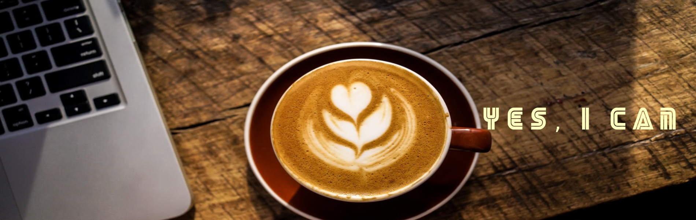

# Hi there 🙋‍♀️ I'm Csilla
### Junior Full Stack Developer

 



```diff

A great inspiration for me
to discover and create something which can help make people's lives easier.
! As a creative, collaborative thinker with a desire to learn;
I would enjoy working in an agile development environment
+ where I can bring my own ideas; able to work across a 
wide variety of tasks to further develop my knowledge
+ in a team that has the freedom and responsibility to make decisions.
```

### Skills
 ⚛️ React
 
 🐍 Python
 
 💻 JavaScript
 
 🌎  HTML / CSS / SASS 
 
  👩‍💻 I’m currently working on 
     
     - runForLife - Sharing platform for charity runners 
 
 📚 I’m currently learning 
   
    - JEST
 
 🤓 Fun fact
 
    - my family name (Barna) means brown🤎 in English 😇 

reach me on 

[](https://www.linkedin.com/in/https://www.linkedin.com/in/csilla-barna//)  my website --> [](https://csillabarna.github.io/)  

